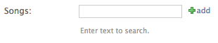

Admin add popup
===============

This enables that green + icon:

The user can click, a popup window lets them create a new object, they click save, the popup closes and the AjaxSelect field is set.

Your `Admin` must inherit from `AjaxSelectAdmin`::

    class YourModelAdmin(AjaxSelectAdmin):
        pass

or be used as a mixin class::

    class YourModelAdmin(AnotherAdminClass, AjaxSelectAdmin):
        pass

or you must implement `get_form` yourself::

    from ajax_selects.fields import autoselect_fields_check_can_add

    class YourModelAdmin(admin.ModelAdmin):

      def get_form(self, request, obj=None, **kwargs):
          form = super(YourModelAdmin, self).get_form(request, obj, **kwargs)
          autoselect_fields_check_can_add(form, self.model, request.user)
          return form

The `User` must also have permission to create an object of that type, as determined by the standard Django permission system.
Otherwise the resulting pop up will just deny them.

Custom Permission Check
-----------------------

You could implement a custom permission check in the `LookupChannel`::

    from permissionz import permissions

    class YourLookupChannel(LookupChannel):

        def can_add(self, user, model):
            return permissions.has_perm('can_add', model, user)

Inline forms in the Admin
-------------------------

If you are using ajax select fields on an Inline you can use these superclasses:

    from ajax_select.admin import AjaxSelectAdminTabularInline, AjaxSelectAdminStackedInline
    # or use this mixin if already have a superclass
    from ajax_select.admin import AjaxSelectAdminInlineFormsetMixin
