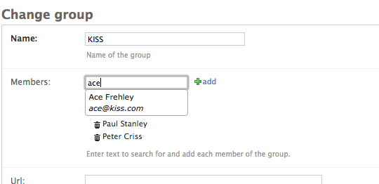
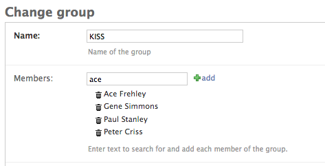

.. django-ajax-selects documentation master file, created by
   sphinx-quickstart on Tue Nov  3 15:23:14 2015.
   You can adapt this file completely to your liking, but it should at least
   contain the root `toctree` directive.

django-ajax-selects
===================

Edit `ForeignKey`, `ManyToManyField` and `CharField` in Django Admin using jQuery UI AutoComplete.

Quick Usage
-----------

Define a lookup channel::

      # yourapp/lookups.py
      from ajax_select import register, LookupChannel
      from .models import Tag

      @register('tags')
      class TagsLookup(LookupChannel):

          model = Tag

          def get_query(self, q, request):
              return self.model.objects.filter(name__icontains=q).order_by('name')[:50]

          def format_item_display(self, item):
              return u"%s" % item.name

Add field to a form::

    # yourapp/forms.py
    class DocumentForm(ModelForm):

        class Meta:
            model = Document

        tags = AutoCompleteSelectMultipleField('tags')

Fully customizable
------------------

- search query
- query other resources besides Django ORM
- format results with HTML
- custom styling
- customize security policy
- customize UI
- integrate with other UI elements on page using the javascript API

Assets included by default
--------------------------

- ajax.googleapis.com/ajax/libs/jquery/1.9.1/jquery.min.js
- code.jquery.com/ui/1.10.3/jquery-ui.js
- code.jquery.com/ui/1.10.3/themes/smoothness/jquery-ui.css

Compatibility
-------------

- Django >=1.5, <=1.9
- Python >=2.7, <=3.4

Index
-----

.. toctree::
   :maxdepth: 2

   Install
   LookupChannel
   Admin
   Forms
   Admin-add-popup
   Media-assets
   Custom-Templates
   jQuery-plugin-options
   jQuery-events
   Ordered-ManyToMany
   Outside-of-Admin
   Example-app
   Release-notes
   Contributing
   modules

* :ref:`genindex`
* :ref:`modindex`
